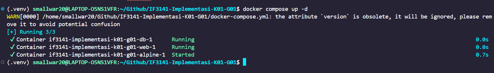
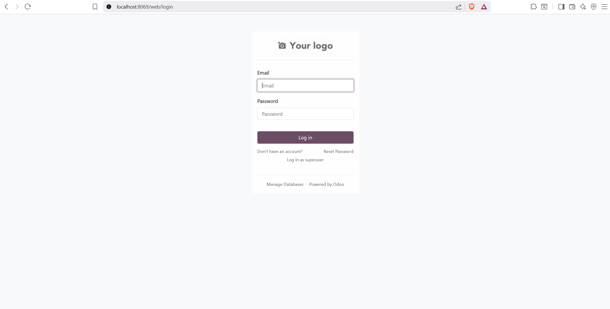
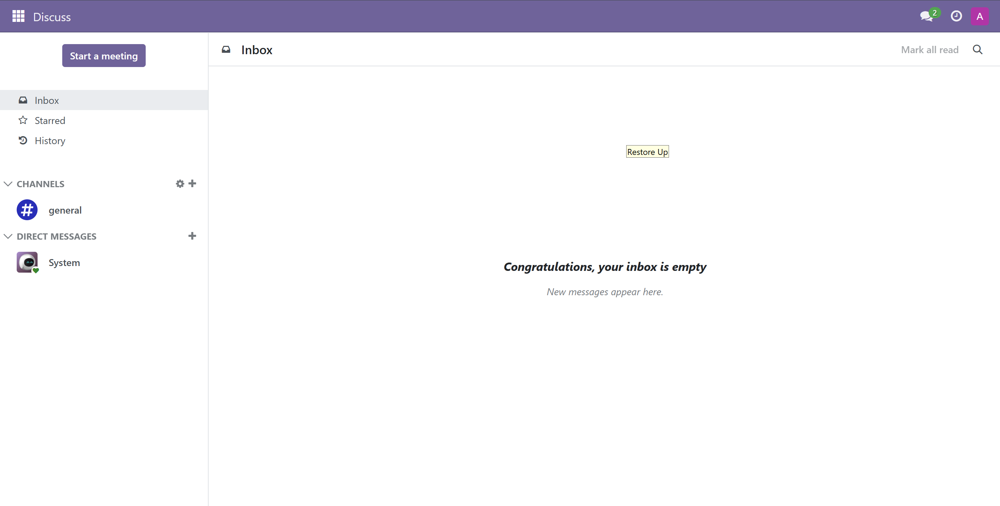
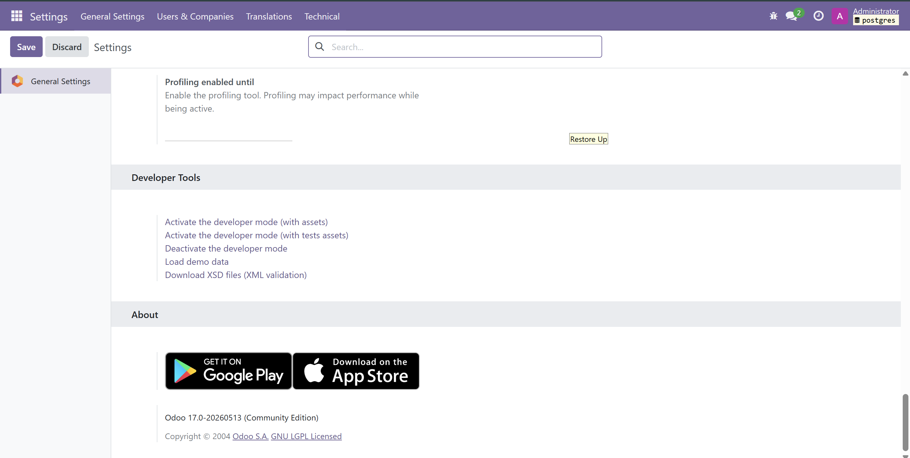
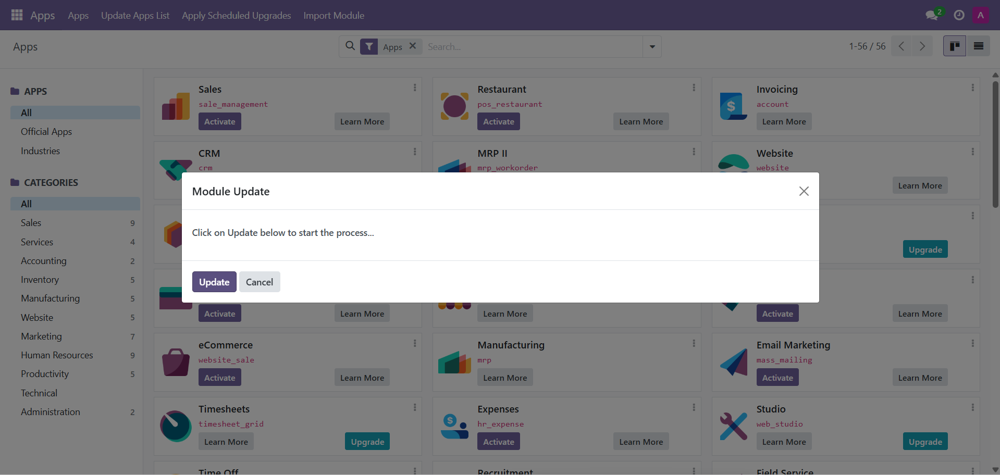
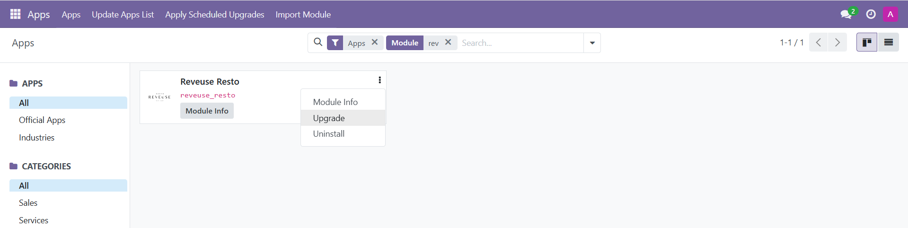
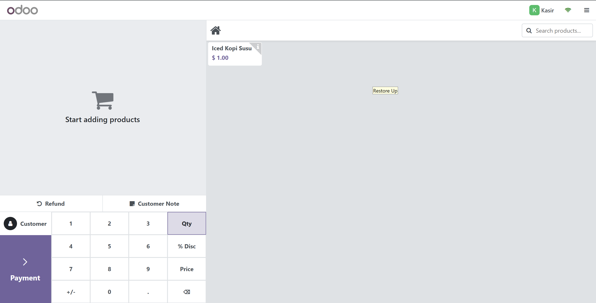
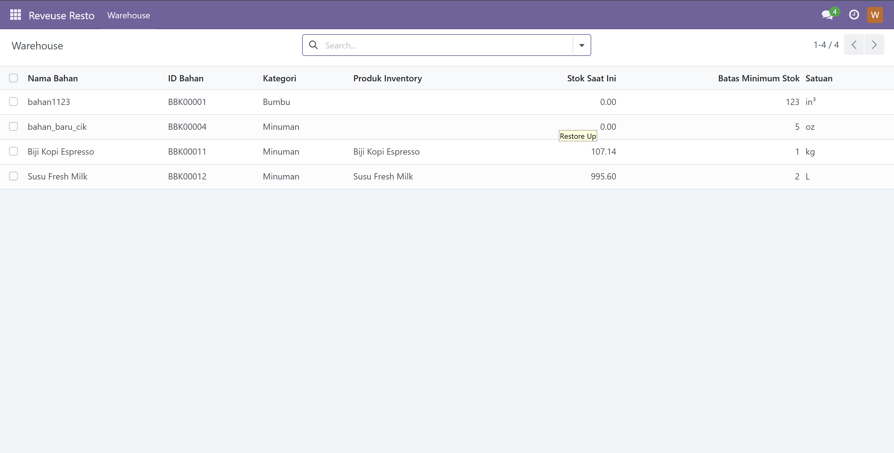
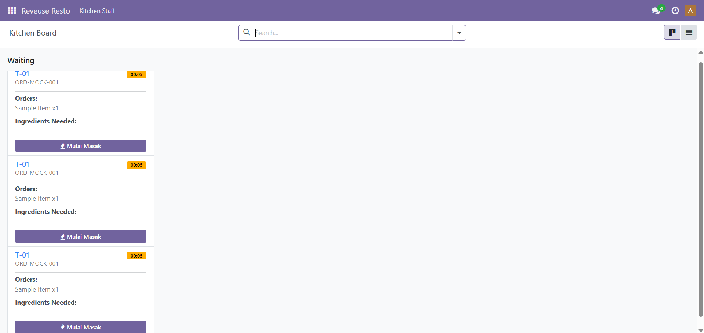
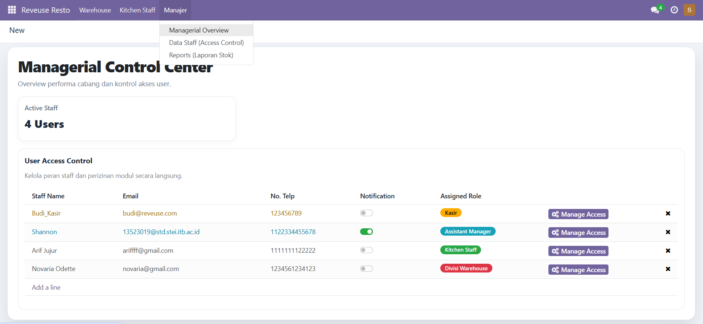

# Sistem Informasi Reveuse Resto

## Identitas Kelompok

Nama Kelompok: **CimolKuahKeju**

Nomor Kelompok: **G01**

Nomor Kelas: **K01**

Anggota Kelompok:

| NIM | Nama |
| --- | --- |
| 13523019 | Shannon Aurellius Anastasya Lie |
| 13523022 | Kenneth Ricardo Chandra |
| 13523032 | Nathan Jovial Hartono |
| 13523054 | Aloisius Adrian Stevan Gunawan |
| 13523055 | Muhammad Timur Kanigara |

## Nama Sistem dan Perusahaan

Nama Sistem: **Sistem Pemantauan Bahan Baku secara Real Time**

Nama Perusahaan: **Reveuse Resto**

## Deskripsi Sistem

Sistem Informasi Reveuse Resto adalah sistem informasi restoran berbasis Odoo yang dirancang untuk mendukung proses operasional utama restoran, mulai dari pengelolaan bahan baku, penerimaan stok, pencatatan pesanan melalui Point of Sale, pemantauan pesanan dapur, hingga pelaporan stok untuk manajemen. Sistem ini memanfaatkan modul standar Odoo seperti Point of Sale, Inventory, dan Manufacturing, lalu menghubungkannya dengan custom module `reveuse_resto` agar proses bisnis restoran dapat dijalankan dari menu yang lebih sesuai dengan role pengguna.

Pada sistem ini, kasir dapat mencatat pesanan pelanggan melalui POS, sementara kebutuhan bahan baku dihitung menggunakan Bill of Materials bertipe Kit/phantom. Ketika pesanan divalidasi di POS, stok bahan baku seperti biji kopi dan susu akan berkurang secara otomatis melalui integrasi Inventory. Bagian Kitchen dapat memantau pesanan yang masuk melalui Kitchen Board dan melihat kebutuhan bahan untuk setiap order, sedangkan bagian Warehouse dapat memantau stok bahan baku yang terhubung dengan produk Inventory. Manajer dapat mengakses laporan dan kontrol data pengguna sesuai kebutuhan operasional restoran.

## Cara Menjalankan Sistem

### 0. Import

Jalankan perintah berikut dari root repository:
- MacOS/Linux
  ```powershell
  ./scripts/export_db.sh
  ```
- Windows
  ```powershell
  scripts\import_db.cmd
  ```

### 1. Menjalankan Container Odoo dan PostgreSQL

Jalankan perintah berikut dari root repository:

```powershell
docker compose up -d
```

Expected result:

```text
Container if3141-implementasi-k01-g01-db-1   Running
Container if3141-implementasi-k01-g01-web-1  Running
```

Screenshot expected result:



### 2. Membuka Odoo

Buka browser dan akses:

```text
http://localhost:8069
```

Expected result: halaman login Odoo tampil.

Screenshot expected result:



### 3. Login sebagai Admin

Gunakan kredensial admin default:

```text
Email: admin
Password: admin
```

Expected result: pengguna berhasil masuk ke dashboard Odoo.

Screenshot expected result:



### 4. Mengaktifkan Developer Mode

Masuk ke **Settings**, lalu aktifkan **Developer Mode**.

Expected result: menu teknis dan tombol update module tersedia.

Screenshot expected result:



### 5. Update Apps List

Masuk ke **Apps**, lalu klik **Update Apps List**.

Expected result: Odoo membaca ulang daftar module dari folder `custom_addons`.

Screenshot expected result:



### 6. Install atau Upgrade Module Reveuse Resto

Cari module **Reveuse Resto**, lalu klik **Install** atau **Upgrade**.

Expected result: module `reveuse_resto` berhasil aktif dan menu **Reveuse Resto** muncul.

Screenshot expected result:



### 7. Menguji Role Kasir

Login sebagai Kasir, lalu buka **Point of Sale**. Mulai POS session, pilih produk `Iced Kopi Susu`, lakukan pembayaran, lalu validasi order.

Expected result: pesanan berhasil dibuat dari POS dan stok bahan baku terkait BoM Kit berkurang.

Screenshot expected result:



### 8. Menguji Role Warehouse

Login sebagai Warehouse, lalu buka **Reveuse Resto > Warehouse**. Cek master data bahan baku seperti `Biji Kopi Espresso` dan `Susu Fresh Milk`. Tambahkan stok melalui menu **Penerimaan Bahan**.

Expected result: stok bahan baku di Warehouse berubah dan tersambung dengan stok Inventory Odoo.

Screenshot expected result:



### 09. Menguji Role Kitchen

Login sebagai Kitchen, lalu buka **Reveuse Resto > Kitchen Staff > Board (Waiting / On Progress)**. Setelah order dibuat dari POS, pesanan akan muncul di Kitchen Board beserta kebutuhan bahan bakunya.

Expected result: Kitchen Board menampilkan order POS dan daftar ingredients yang dibutuhkan.

Screenshot expected result:


### 10. Menguji Penggunaan Bahan

Buka **Reveuse Resto > Kitchen Staff > Penggunaan Bahan**.

Expected result: sistem menampilkan histori bahan yang digunakan berdasarkan pesanan POS dan BoM Kit.

Screenshot expected result:



### 11. Menguji Role Manajer

Login sebagai Manajer, lalu buka **Reveuse Resto > Manajer** untuk melihat managerial overview, data staff, dan laporan stok.

Expected result: Manajer dapat mengakses fitur pemantauan dan pelaporan.

Screenshot expected result:



## Kredensial User Setiap Role

| Role | Login | Password | Menu Utama |
| --- | --- | --- | --- |
| Admin | `admin` | `admin` | Semua menu Odoo |
| Assistant Manager | `manager@reveuse.com` | `manager123` | Manajer, Warehouse, Kitchen |
| Kasir | `kasir@reveuse.com` | `kasir123` | Kasir / POS |
| Kitchen | `kitchen@reveuse.com` | `kitchen123` | Kitchen Staff |
| Warehouse | `warehouse@reveuse.com` | `warehouse123` | Warehouse |

## Kesimpulan dan Saran

Sistem Informasi Reveuse Resto telah mengintegrasikan proses kasir, dapur, gudang, dan manajemen dalam satu sistem berbasis Odoo. Integrasi POS dengan BoM Kit memungkinkan kebutuhan bahan baku dihitung otomatis dari pesanan, sedangkan Warehouse dapat melihat stok bahan yang terhubung dengan Inventory Odoo. Dengan demikian, sistem dapat membantu restoran memantau penggunaan bahan dan alur pesanan secara lebih terstruktur.

Saran pengembangan selanjutnya adalah menambahkan dashboard analitik yang lebih lengkap untuk manajer, memperluas variasi menu dan resep BoM, serta menambahkan fitur stock adjustment langsung dari Warehouse. Selain itu, pengujian end-to-end untuk setiap role perlu dilakukan secara rutin agar integrasi antara POS, Kitchen, Warehouse, dan laporan tetap konsisten ketika ada perubahan proses bisnis.
